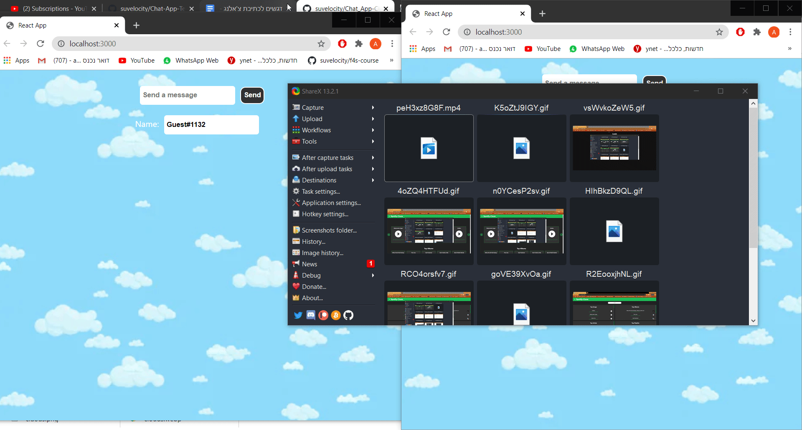

## Chat App
Hello friend, today we are going to help you create a simple Chat-App.

In the app you will have to create both client and backend using [React](https://reactjs.org/) and [Express](https://expressjs.com/) accordingly.

You have all the requirements below + A gif that will help you understand our requirements.

Don't worry, we already took care of the CSS, the dependencies, the React configuration and the express configuration so chill and enjoy.

## Before You Start:
- Clone [this](https://github.com/suvelocity/Chat-App-Template), in this repository you will work to complete the challenge. **Do not change the name of any file or folder, this will mess up the tests.
- Run 'npm install' to install all dependencies. Do it on both the client folder and the server folder.
- If you want to run the tests, you can run 'npm run test'. Again, Do it on both the client folder and the server folder (the tests for client can take a bit longer).
- You can run 'npm start' in the client folder to start the client app.
- You can run 'npm run dev' in the server folder to run the server with [Nodemon](https://www.npmjs.com/package/nodemon).

        Enjoy Coding and Goodluck!!!

## Requirements Server: 
1. We will start by creating a 'messages' variable and set it to an empty array.
This array will contain objects with message data.
  
2. Create a GET "/messages" endpoint that responds all the existing messages.

3. Create a POST "/messages" endpoint that adds a new message to the existing messages array. The message will be inside the body of the request and should like so: 
{ body: 'message', user: 'name'}. 
The end Point should respond back the string 'sent'.

Now try to run the server tests. They should pass!

## Requirements Client: 
1. We will start by creating a simple text input with the **id = 'messageInput'** and make it 'required'.

2. Create a button with the **id = 'sendButton'** and set the type = 'submit' and value = 'Send'. This button will POST your message.

3. Wrap both the button and the input in a "form" tag.

4. Create a state variable called messages that starts with the value of an empty array.

5. Create a [useEffect](https://reactjs.org/docs/hooks-effect.html) with an empty dependencies array.
Inside, create an [interval](https://www.w3schools.com/jsref/met_win_setinterval.asp).
That interval gets 2 parameters: \
The first one is a callback function, \
The second one is a number of milliseconds. \
The callback function will be activated in loops based on the time from the second parameter. for now, set the time to 1000ms.

6. Inside the interval callback function,
  create an http request to your GET ('/messages') endpoint,
  and then save the received data to a state variable called 'messages'. \
  You can use axios that is already installed in the projects dependencies.

7. Create a state variable named 'user' and set it to a default of an empty string. Inside the useEffect, create a [random](https://www.w3schools.com/js/js_random.asp) number between 1-2000 and set the user variable value to: 'Guest#' + randomNumber. That will be your username for now.

8. **Great work so far!** , now your messages state variable is constantly getting updated with all the messages in your server. \
Now it is time to activate your input. \
create a state variable called 'inputValue' and set it to an empty string. Add an onChange attribute to your input. Create a function to pass the inputs value to the inputValue state variable (use the event.target.value). Add a value attribute to your input and set it to the inputValue variable.

9. Create a new function with the name 'postMessage' that gets a property (e).\
In this function add a POST request to your ('/messages') endpoint and send it an object with params 'body' and 'user.\
The 'body' param should come from the inputValue state variable.\
The 'user' param should contain the user state variable (the random number from before). \
your 'message' object should look like this:\
{ body: inputValue, user: user}
don't forget to add ['e.preventDefault()'](https://developer.mozilla.org/en-US/docs/Web/API/Event/preventDefault) in the beginning of the function to prevent the page from refreshing on submit. \
Also, in the end of the function you should set the value of the inputValue state to be an empty string in order to clear the input. \
Now all thats left is to add to your form the attribute 'onSubmit={postMessage}' 

10. Create a new div below the form with a **class = 'messagesContainer'**. inside that div, take your messages state and [map](https://developer.mozilla.org/en-US/docs/Web/JavaScript/Reference/Global_Objects/Array/map) through it to print all of the messages in the server. Your print should have a div containing both the message.body and the message.user. That div should have a class name of **'msg'**. \
Don't forget to give the div a 'key' attribute with a unique value.

11. **WOW!** you should now have a working chat app! you can open the app on two windows and see how you can send messages from one to the other. the only thing missing is proper user names and a little bit of design.\
Lets add a new input below the form with the **id = 'changeUserInput'** and set its value to the user state you have (the state that contains the random number). now also add an onChange() to that input to make sure you change the user state to the value of the input. now you can write in that input your name, and this will be your user name.

12. The last thing to add is a different design to messages written by you and messages written by other users.\
In your map function that prints all messages, change the className of the div being printed for each message, and set it to:\
message.user === user ? 'my-msg msg' : 'other-msg msg'\
You should also add a 'strong' tag around message.user to highlight it. \ 
We took care of the rest of the CSS for you!

**Congrats!** your chat app is done! you should be able now to pass all tests! if not, look carefully again at the requirements and make sure you did everything right.
                              

